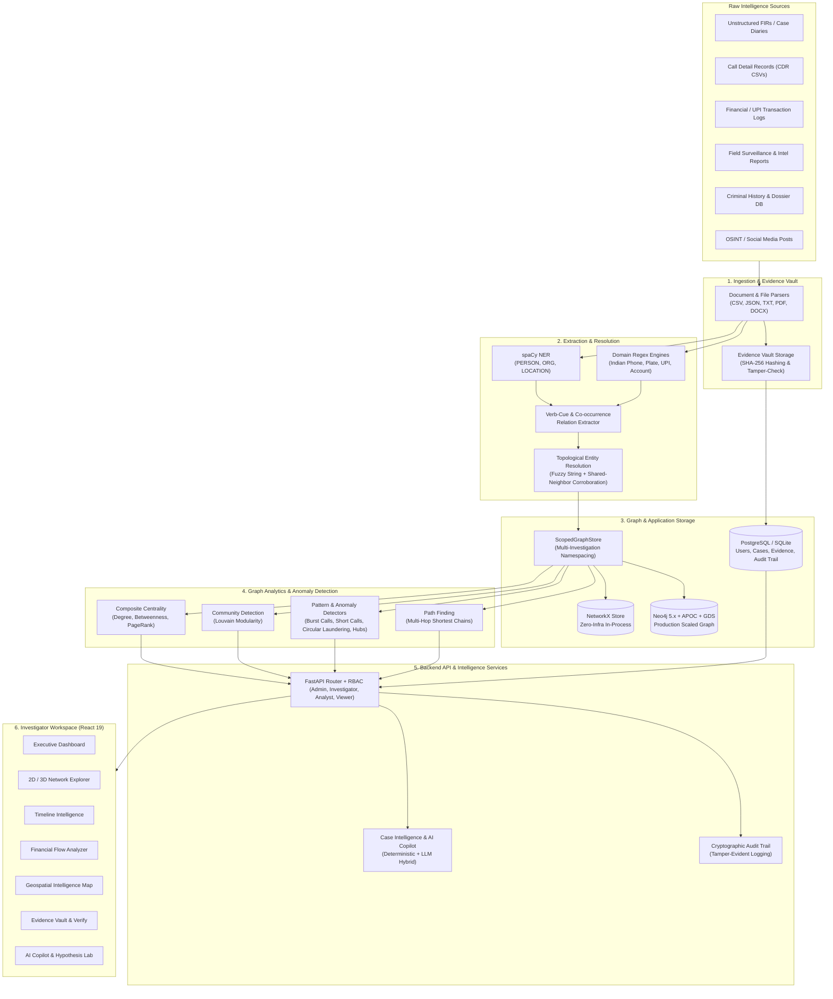
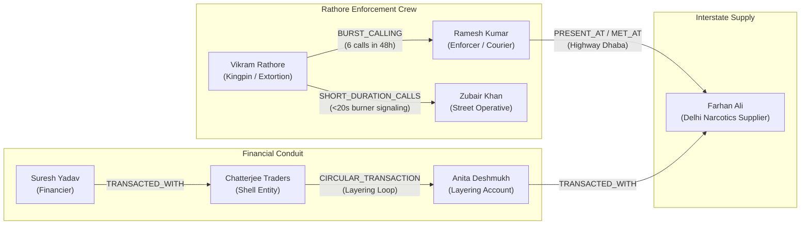
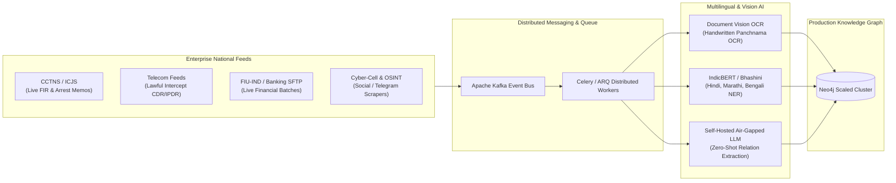

# PRAHARI / KNOT6 — AI-Powered Criminal Network Analysis System

[](https://www.sih.gov.in/)
[](https://ncrb.gov.in/)
[](#)
[](backend/)
[](frontend/)
[](backend/app/db/graph_store.py)
[](backend/app/db/models.py)

**PRAHARI** (operating under the project architecture **KNOT6**) is an advanced, production-ready AI intelligence platform developed as a working prototype for **Smart India Hackathon (SIH) Problem Statement 26189**, issued by the **Ministry of Home Affairs (MHA) / National Crime Records Bureau (NCRB) — Women Safety Division**.

The platform ingests fragmented, heterogeneous law enforcement data—including First Information Reports (FIRs), Call Detail Records (CDRs), banking/UPI financial transactions, criminal history records, surveillance notes, and social media intelligence. It applies natural language processing, entity resolution, and graph theory to synthesize these disparate sources into an **investigation-scoped Knowledge Graph**, automatically surfacing syndicate kingpins, covert operational cells, suspicious anomalies, and hidden evidentiary connections for law enforcement investigators.

---

## Table of Contents

1. [The Problem Statement & Operational Challenges](#1-the-problem-statement--operational-challenges)
2. [Architectural Overview](#2-architectural-overview)
3. [Core Capabilities & Technical Solutions](#3-core-capabilities--technical-solutions)
   - [3.1 Multi-Source Ingestion & Evidence Vault](#31-multi-source-ingestion--evidence-vault)
   - [3.2 Domain-Adapted Information Extraction (NLP + Regex)](#32-domain-adapted-information-extraction-nlp--regex)
   - [3.3 Topological Entity Resolution & Alias Merging](#33-topological-entity-resolution--alias-merging)
   - [3.4 Dual-Mode Graph Engine & Scoped Multi-Tenancy](#34-dual-mode-graph-engine--scoped-multi-tenancy)
   - [3.5 Explainable Graph Analytics & Crime Anomaly Detection](#35-explainable-graph-analytics--crime-anomaly-detection)
   - [3.6 Investigator Experience & Specialized Intelligence Views](#36-investigator-experience--specialized-intelligence-views)
4. [Technology Stack](#4-technology-stack)
5. [The Synthetic Demo Syndicate ("Operation Nexus")](#5-the-synthetic-demo-syndicate-operation-nexus)
6. [Quick Start & Setup Guide](#6-quick-start--setup-guide)
   - [Mode A: Zero-Infrastructure Demo Mode (Local Development)](#mode-a-zero-infrastructure-demo-mode-local-development)
   - [Mode B: Production-Shaped Docker Stack](#mode-b-production-shaped-docker-stack)
7. [Automated Verification & Test Suite](#7-automated-verification--test-suite)
8. [Security, Governance & Evidentiary Integrity](#8-security-governance--evidentiary-integrity)
9. [Future Roadmap (v2): Scaled Neo4j Architecture & Ingestion Pipeline](#9-future-roadmap-v2-scaled-neo4j-architecture--ingestion-pipeline)
   - [9.1 Future Neo4j Architecture & Native Graph Data Science (v2)](#91-future-neo4j-architecture--native-graph-data-science-v2)
   - [9.2 Future Enterprise Ingestion Pipeline & Multilingual AI (v2)](#92-future-enterprise-ingestion-pipeline--multilingual-ai-v2)

---

## 1. The Problem Statement & Operational Challenges

Modern criminal organizations, organized trafficking syndicates, and financial cyber-fraud networks rarely operate in isolation. However, the data collected by state police forces and central investigative agencies is inherently **fragmented across disparate silos**:

* **Siloed & Multi-Modal Datasets:** Evidence is scattered across unformatted FIRs (CCTNS), raw telecom CDR CSVs, bank and UPI transaction ledgers, field surveillance debriefs, and criminal past-record databases.
* **The Manual Cross-Referencing Bottleneck:** Detectives and crime analysts spend hundreds of man-hours manually cross-referencing call sheets, bank statements, and witness testimonies using spreadsheets and paper dockets.
* **Invisible Covert Intermediaries:** Syndicate kingpins and illegal financiers rarely contact victims or street-level operatives directly. They utilize layered chains of money mules, shell companies, and disposable burner SIMs to stay detached from direct evidence.
* **Evidentiary Integrity Risks:** Law enforcement analysis must stand up in a court of law under the Indian Evidence Act. Black-box AI models that output opaque risk scores without citing verifiable source records or that permit unverified data modification risk evidentiary rejection.

**PRAHARI / KNOT6 solves this** by providing an end-to-end automated pipeline that extracts structured entities and relationships from raw evidence files, builds a connected knowledge graph, and provides explainable, mathematically rigorous graph analytics alongside a human-in-the-loop investigative interface.

---

## 2. Architectural Overview

The system is structured as a decoupled, multi-tier architecture separating business metadata, evidence vault storage, graph computation, and client visualization:



---

## 3. Core Capabilities & Technical Solutions

### 3.1 Multi-Source Ingestion & Evidence Vault
* **Heterogeneous Ingestion Loaders (`app/ingestion/`):**
  * **Structured Data:** High-throughput streaming parsers for CDR records (caller, callee, timestamp, duration, cell-tower location), financial ledgers (sender, receiver, amount, mode, transaction ID), and criminal dossiers (aliases, previous FIRs, registered addresses).
  * **Unstructured Text:** Natural language parsers handling raw police narratives, witness statements, informant intelligence, and interrogation transcripts.
* **Evidence Vault (`app/services/storage.py`, `app/api/routes/evidence.py`):**
  * Ingested evidence files are assigned persistent metadata records in PostgreSQL and stored securely on disk under investigation-scoped directories.
  * Every uploaded file is hashed immediately using **SHA-256**.
  * The Vault provides an on-demand cryptographic verification endpoint (`/api/investigations/{id}/evidence/{evidence_id}/verify`) that re-hashes physical bytes against stored checksums, returning `VERIFIED` or `MISMATCH` to detect tampering or accidental file corruption.

### 3.2 Domain-Adapted Information Extraction (NLP + Regex)
* **Statistical Named Entity Recognition (`app/nlp/entity_extraction.py`):**
  * Leverages a pre-trained spaCy NLP pipeline to extract generic linguistic entities: `PERSON`, `ORGANIZATION`, and `LOCATION` (`GPE`, `LOC`, `FAC`).
* **Indian Domain-Specific Pattern Matchers (`app/nlp/patterns.py`):**
  * **Phone Numbers:** Standard 10-digit Indian mobile numbers and international `+91` formats.
  * **Vehicle Registration Plates:** Regex conforming to Indian Motor Vehicles Act formats across all states (e.g., `MP09AB1234`, `DL1CAB1234`, `MH12DE5678`).
  * **Financial Identifiers:** Indian bank account numbers (9–18 digits) and Unified Payments Interface (UPI) handles (e.g., `name@okhdfcbank`, `mobile@paytm`).
* **Sentence-Level Relationship Extraction with Full Evidentiary Provenance:**
  * Extracts semantic predicates using lemma verb mapping (`called`, `dialed`, `transferred`, `paid`, `drove`, `fled`, `met`, `visited`).
  * Every extracted edge stores the exact sentence and `evidence_id` in its `evidence` array. Investigators can click any relationship in the link chart and view the exact police report sentence from which the fact was extracted.

### 3.3 Topological Entity Resolution & Alias Merging
A key risk in criminal investigations is identity fragmentation (e.g., "Raj Malhotra" in a CDR, "Rajesh Malhotra" in an FIR, and "R. Malhotra" on social media).
* **Deterministic Key Collapse:** Entities with identical natural keys (phone numbers, bank accounts, vehicle plates) are deterministically merged at creation time (`app/graph/graph_builder.py`).
* **Fuzzy Name Matching + Network Corroboration (`app/resolution/entity_resolution.py`):**
  * Uses `rapidfuzz.token_sort_ratio` to compute lexical similarity.
  * **Strict Safety Gate:** Name similarity alone is **never** sufficient for automatic merging unless it is near-identical ($\ge 97\%$, representing obvious typos).
  * For names with similarity between $80\%$ and $96\%$, the algorithm requires **shared-neighbor corroboration**—the two candidates must share at least one topological connection (e.g., same phone, co-located vehicle, identical address, or co-accused in the same case).
* **Human-in-the-Loop Review Queue:** Candidates meeting partial criteria are surfaced via `GET /api/entities/resolution/candidates` for analyst confirmation rather than silently distorting the intelligence graph.

### 3.4 Dual-Mode Graph Engine & Scoped Multi-Tenancy
The backend abstracts all graph operations behind the generic `GraphStore` interface (`app/db/graph_store.py`):

| Characteristic | Zero-Infrastructure Mode (`NetworkXGraphStore`) | Production Mode (`Neo4jGraphStore`) |
|---|---|---|
| **Underlying Engine** | Pure in-process Python `networkx.MultiDiGraph` | Neo4j 5.x Community/Enterprise over Bolt protocol |
| **External Dependencies** | None (Runs directly via standard Python libraries) | Neo4j container with APOC & Graph Data Science (GDS) |
| **Primary Use Case** | Instant evaluation, offline laptops, test suite execution | Full-scale pilot deployment, multi-million node graphs |
| **Switching Seam** | Configured via `GRAPH_BACKEND=networkx` in `.env` | Configured via `GRAPH_BACKEND=neo4j` in `.env` |

* **`ScopedGraphStore` Multi-Tenancy:**
  * To prevent cross-contamination between different police operations, `ScopedGraphStore` decorates the underlying store.
  * It transparently namespaces physical IDs (`inv_<investigation_id>::<logical_id>`) on write and unscopes them on read.
  * Different investigations running on the same Neo4j cluster remain strictly isolated without requiring separate database clusters.

### 3.5 Explainable Graph Analytics & Crime Anomaly Detection
The analytics suite (`app/analytics/`) maps directly to real-world criminal intelligence questions:

1. **Composite Key Influencer Detection (`centrality.py`):**
   * Computes **Degree Centrality** (identifying high-activity hubs), **Betweenness Centrality** (identifying clandestine brokers, couriers, and money mules bridging separate cells), and **PageRank** (identifying entities connected to other high-influence nodes).
   * Generates a combined, explainable score highlighting targets who would otherwise remain hidden behind layers of subordinates.
2. **Sub-Gang & Cell Segmentation (`community.py`):**
   * Executes **Louvain community detection** over weighted multi-modal edges, automatically clustering syndicates into operational cells (e.g., enforcement muscle, financial laundering conduits, external suppliers).
3. **Behavioral Anomaly Detection (`anomaly.py`):**
   * `BURST_CALLING`: Detects sudden spikes in call volume between suspects within rolling 48-hour windows (indicating imminent or coordinated operations).
   * `SHORT_DURATION_CALLS`: Flags pairs where $\ge 70\%$ of calls are under 20 seconds (burner phone operational signaling).
   * `CIRCULAR_TRANSACTION`: Discovers closed financial loops ($A \to B \to C \to A$) characteristic of trade-based money laundering and layering.
   * `NEW_HIGH_DEGREE_NODE`: Flags nodes whose connectivity drastically exceeds network averages.
   * `LOCATION_CO_CONVERGENCE`: Identifies independent records placing multiple suspects at the same geographical point within overlapping timeframes.
4. **Path Finding (`pathfinder.py`):**
   * Multi-hop bidirectional shortest path algorithm that answers: *"How is Suspect A connected to Suspect B?"* revealing chains of intermediaries across phone calls, banking transfers, and co-locations.

### 3.6 Investigator Experience & Specialized Intelligence Views
The frontend (`frontend/src/`) provides a tailored intelligence suite built with React 19, TypeScript, and Tailwind CSS:
* **2D & 3D Network Explorer (`pages/NetworkExplorer.tsx`, `components/NetworkGraph3D.tsx`):** Force-directed link-chart visualization featuring 3D camera controls, node degree filtering, community coloring, and an Entity Detail Drawer with source document citations.
* **Case Workspace (`pages/Investigations.tsx`, `pages/CaseDetail.tsx`):** Structured hierarchy mapping real-world investigations to cases and evidence dockets.
* **Timeline Intelligence (`pages/Timeline.tsx`):** Chronological stream of calls, transactions, and sightings with interactive time-window scrubbers.
* **Financial Flow Analyzer (`pages/FinancialIntelligence.tsx`):** Sankey-style and directed transaction graph isolating financial flows and circular layering loops.
* **Geospatial Intelligence Map (`pages/GeoIntelligence.tsx`):** Map plotting suspect movements, crime scenes, and cell tower pings with coordinate bounding.
* **AI Investigation Copilot & Hypothesis Lab (`pages/AICopilot.tsx`, `pages/HypothesisLab.tsx`):** Natural-language investigative assistant that answers queries with citations, and tests hypotheses (e.g., *"Is Suspect X acting as a courier for Syndicate Y?"*) by compiling supporting and contradicting graph signals.
* **Cryptographic Audit Integrity (`pages/AuditIntegrity.tsx`):** Tamper-evident log inspecting every ingestion, entity merge, user login, and evidence verification event.

---

## 4. Technology Stack

```
KNOT6 / PRAHARI System
├── Backend Core
│   ├── Framework: FastAPI (Python 3.11 - 3.14 compatible)
│   ├── Relational ORM: SQLAlchemy 2.0 & Alembic (PostgreSQL 16 / SQLite)
│   ├── Security: PyJWT (RS256/HS256), Passlib, Bcrypt (pinned 4.0.1)
│   └── Validation: Pydantic v2
├── Graph & NLP Intelligence
│   ├── In-Process Graph: NetworkX 3.x
│   ├── Production Graph: Neo4j 5.24 Community (Bolt Driver, APOC, GDS)
│   ├── NLP / NER: spaCy (en_core_web_sm pipeline)
│   ├── Entity Resolution: RapidFuzz (C++ accelerated token sort metrics)
│   └── Graph Algorithms: python-louvain, Scipy
├── Frontend Application
│   ├── Framework: React 19 + TypeScript + Vite
│   ├── Styling: Tailwind CSS
│   ├── Visualization: react-force-graph (2D & 3D WebGL via Three.js)
│   ├── UI Components: Lucide React, Headless UI
│   └── State Management: Context API & Custom Hooks
└── DevOps & Infrastructure
    ├── Containerization: Docker & Docker Compose v2
    └── Storage: Local File System / Object Store with SHA-256 Checksums
```

---

## 5. The Synthetic Demo Syndicate ("Operation Nexus")

The repository bundles a complete, legally compliant, fictionalized demo dataset in `backend/data/demo/`. When the backend starts with `AUTO_SEED_DEMO=true` (default), it populates an active investigation called **"Operation Nexus"** (Case **CASE-001**):



### What the Analytics Engine Discovers:
1. **Hidden Kingpins via Betweenness Centrality:** While Vikram Rathore has the highest call count, **Suresh Yadav** and **Farhan Ali** rank at the top of composite centrality because they bridge the financial and supply chains.
2. **Layering Loop Detection:** Discovers a circular transfer between `ACC1001` $\to$ `ACC1002` $\to$ `ACC1004` $\to$ `ACC1001`.
3. **Burner Signaling:** Flags Rathore and Zubair Khan for repeatedly engaging in calls under 20 seconds.
4. **Multi-Hop Path Finding:** Tracing a connection between Vikram Rathore and Farhan Ali uncovers the non-obvious link through Ramesh Kumar's physical meeting at the highway dhaba.

---

## 6. Quick Start & Setup Guide

The application supports two execution modes: **Zero-Infrastructure Demo Mode** (zero setup, ideal for testing/evaluation) and **Production-Shaped Docker Stack** (full microservices).

### Mode A: Zero-Infrastructure Demo Mode (Local Development)

Runs everything in-process using NetworkX and a local SQLite database. No external servers or containers required.

#### 1. Backend Setup
```bash
# Clone repository
git clone https://github.com/sarveshpourkar/KNOT6-SIH26189.git
cd KNOT6-SIH26189/backend

# Create and activate virtual environment
python -m venv .venv
source .venv/bin/activate       # On Windows: .venv\Scripts\activate

# Install dependencies and spaCy language model
pip install -r requirements.txt
python -m spacy download en_core_web_sm

# Launch FastAPI server (auto-seeds Operation Nexus demo dataset)
uvicorn app.main:app --reload --port 8000
```
* Interactive Swagger API Docs: `http://localhost:8000/docs`

#### 2. Frontend Setup
```bash
cd ../frontend
npm install
npm run dev
```
* Web Application: `http://localhost:5173`

---

### Mode B: Production-Shaped Docker Stack

Runs the full target production architecture: **PostgreSQL 16** (application metadata & audit log) + **Neo4j 5.24** (APOC & Graph Data Science plugins) + **FastAPI Backend** + **React Frontend**.

```bash
cd KNOT6-SIH26189

# Build and run all services
docker compose up --build
```

#### Service Endpoints:
* **Frontend Web Application:** `http://localhost:5173`
* **FastAPI Backend API:** `http://localhost:8000` (`http://localhost:8000/docs`)
* **Neo4j Browser Console:** `http://localhost:7474` (Auth: `neo4j` / `prahari_password`)
* **PostgreSQL Database:** `localhost:5432` (Database: `knot6`, User: `knot6`, Password: `knot6_dev_password`)

---

### Pre-Configured Demo Credentials (RBAC)

The system initializes with four role-based accounts:

| Role | Username | Password | Permissions & Access Scope |
|---|---|---|---|
| **Admin** | `admin` | `admin123` | Full administrative control, system settings, cryptographic audit log inspection, demo dataset reset. |
| **Investigator** | `investigator` | `investigator123` | Create investigations/cases, upload evidence, run graph analytics, explore link charts, query AI copilot. |
| **Analyst** | `analyst` | `analyst123` | All investigator permissions, plus review and confirm/reject candidate entity resolution merges. |
| **Viewer** | `viewer` | `viewer123` | Read-only inspection of cases, link charts, and reports; cannot upload evidence or modify state. |

---

## 7. Automated Verification & Test Suite

The repository includes a comprehensive `pytest` test suite covering ingestion, NER, fuzzy entity resolution, graph analytics, investigation isolation, and file integrity:

```bash
cd backend
pytest -v
```

### Key Test Suites:
* `test_analytics.py`: Validates composite centrality, Louvain clustering, circular transaction detection, and pathfinding algorithms.
* `test_entity_extraction.py`: Tests spaCy NER and regex extractors on raw FIR narratives and Indian identifiers.
* `test_entity_resolution.py`: Verifies rapidfuzz thresholds and shared-neighbor corroboration safeguards.
* `test_phase1_investigations.py`: Validates strict data isolation across distinct investigations via `ScopedGraphStore`.
* `test_integrity_and_resolution.py`: Tests SHA-256 evidence hashing and tamper detection.
* `test_case_intelligence.py` & `test_hypothesis.py`: Tests the deterministic and LLM-assisted copilot pipelines.

---

## 8. Security, Governance & Evidentiary Integrity

Built for law enforcement deployment, PRAHARI incorporates strict governance safeguards:

1. **Evidentiary Traceability:** Graph edges maintain source document IDs and verbatim sentence snippets, ensuring all intelligence leads are admissible and verifiable under legal scrutiny.
2. **Human-in-the-Loop Safeguards:** Entity merges below $97\%$ confidence require human analyst confirmation. Anomaly flags are categorized as leads, never automated accusations.
3. **Cryptographic Integrity:** Evidence files are secured with SHA-256 checksums, and audit entries are recorded durably in PostgreSQL to prevent retroactive record falsification.
4. **Air-Gapped & Offline Ready:** The core system requires no external cloud APIs or third-party LLMs to function. All NER, graph calculations, and database operations run on private, secure police intranets.

---

## 9. Future Roadmap (v2): Scaled Neo4j Architecture & Ingestion Pipeline

To advance the PRAHARI / KNOT6 prototype from an operational pilot into an enterprise-scale, nationwide system deployed across state cyber-cells and NCRB headquarters, the following technical roadmap is planned for **Version 2.0**:

### 9.1 Future Neo4j Architecture & Native Graph Data Science (v2)

In the current prototype, `Neo4jGraphStore` provides persistent storage while complex analytics (centrality, Louvain, anomaly heuristics) materialize subgraphs into Python memory via `to_networkx()`. While optimal for investigations up to tens of thousands of entities, scaling to nationwide NCRB data (millions of individuals, hundreds of millions of CDR/financial records) requires shifting to **native in-database graph computation**:

```mermaid
flowchart TD
    subgraph CurrentPrototype["Current v1 Architecture"]
        N1[Neo4j 5.x Storage] -->|Pull subgraph via Cypher| PY[Python Memory / NetworkX]
        PY -->|Execute algorithms in Python| RES1[Analytics Output]
    end

    subgraph FutureV2["Future v2 Architecture"]
        N2[Neo4j 5.x / Enterprise Cluster]
        GDS[In-Memory GDS Graph Projections]
        HYPER[First-Class Temporal Event Nodes]
        VEC[Neo4j Vector Index]

        N2 --> GDS
        GDS -->|Native Cypher GDS Calls\ngds.pageRank.stream\ngds.louvain.stream| RES2[Sub-Second Massive Scale Results]
        N2 --> HYPER -->|Temporal Cypher Queries\nMATCH (a)-[:CALL]->(e:Event)-[:TARGET]->(b)| SEQ[Complex Sequence Analysis]
        N2 --> VEC -->|Hybrid Vector + Graph Search| RAG[Graph RAG Case Intelligence]
    end
```

#### Key v2 Neo4j Architectural Enhancements:
1. **Native Graph Data Science (GDS) Procedure Execution:**
   * Transition from Python-side NetworkX calculations to **Neo4j GDS in-memory graph projections**.
   * Run PageRank (`gds.pageRank.stream`), Betweenness (`gds.betweenness.stream`), FastRP embeddings (`gds.fastRP.stream`), and Louvain (`gds.louvain.stream`) directly within Neo4j's optimized C++/Java memory space, enabling sub-second execution across 100M+ edges.
2. **First-Class Temporal Event Modeling (Hypergraphs):**
   * Transition from static aggregated edges (`CALLED` with event metadata) to a **first-class Event-Node architecture**:
     ```cypher
     (:Person {name: "Vikram"})-[:INITIATED]->(c:CallEvent {timestamp: datetime("..."), duration: 18, cell_id: "TWR-401"})-[:REACHED]->(:Person {name: "Zubair"})
     ```
   * Enables native Cypher temporal sliding-window queries and complex event pattern matching (e.g., detecting suspects who made calls within 5 minutes of a financial transfer across three hops).
3. **Database-Native Multi-Tenancy & Partitioning:**
   * Replace application-level string namespacing (`inv_<id>::`) with **Neo4j 5.x Multi-Database Tenancy** or native property/label-based access control filters (`WHERE node.investigation_id = $inv_id`), combined with Neo4j Fabric for controlled cross-case federation when cross-jurisdictional syndicate overlaps emerge.
4. **Automated Graph CDC (Change Data Capture) & Triggers:**
   * Implement Neo4j APOC triggers and Kafka-based Neo4j Streams CDC. When a new transaction is committed, database triggers automatically execute circular transaction detection and alert investigators in real time.
5. **Hybrid Graph Vector Embeddings & Graph RAG:**
   * Ingest text embeddings of FIR narratives and suspect Modus Operandi (MO) directly into Neo4j's native **Vector Indexes**.
   * Perform hybrid topological-semantic queries (e.g., *"Find suspects with an extortion MO matching Case X who are topologically within two hops of Suspect Y"*).

---

### 9.2 Future Enterprise Ingestion Pipeline & Multilingual AI (v2)

The current ingestion system utilizes direct file uploads and rule-augmented spaCy/regex extractors. Version 2.0 introduces an enterprise, automated ingestion pipeline capable of continuous real-time intake from national databases and multi-lingual Indian sources:



#### Key v2 Ingestion Capabilities:
1. **Direct CCTNS & ICJS Interoperability:**
   * Develop native API connectors for the **Crime and Criminal Tracking Network & Systems (CCTNS)** and **Inter-operable Criminal Justice System (ICJS)**.
   * Enables automated real-time ingestion of new FIRs, seizure memos, and charge sheets across police stations without requiring manual CSV/text re-entry.
2. **Automated Telecom & Banking Streaming Feeds:**
   * Ingestion adapters for standardized telecom lawful-intercept formats (ETSI, 3GPP, raw ASN.1 and CSV dumps) with automated cell-tower triangulation.
   * Integration with FIU-IND and banking SFTP endpoints for automated processing of Suspicious Transaction Reports (STRs) and bulk NEFT/RTGS/IMPS/UPI logs.
3. **Distributed Asynchronous Processing Pipeline:**
   * Decouple file upload from extraction using an **Apache Kafka** event bus and **Celery / Redis / ARQ** distributed worker clusters.
   * Handles multi-gigabyte CDR dumps and historical case file archives with automatic retry policies, backpressure handling, and dead-letter queues.
4. **Multilingual Indian NLP (IndicBERT & Bhashini):**
   * State police FIRs are predominantly drafted in regional languages. Version 2.0 integrates fine-tuned multilingual transformer models (e.g., **IndicBERT**, Sarvam AI, and Government of India **Bhashini** APIs) to extract entities from Hindi, Marathi, Bengali, Tamil, Telugu, and Punjabi narratives.
5. **Intelligent Document OCR for Handwritten Records:**
   * Integrates an advanced document layout and vision pipeline (Surya OCR / Donut / PaddleOCR) specifically fine-tuned for scanned, low-contrast, and handwritten Indian police case diaries (*panchnamas*) and seizure lists.
6. **Air-Gapped In-VPC LLM Information Extraction:**
   * Deploys self-hosted, quantized open-weight LLMs (e.g., Llama 3 / Mistral / Gemma 2 via vLLM) strictly within the agency's secure data center.
   * Employs structured JSON schema output and function calling to perform zero-shot, open-vocabulary relation extraction and automated investigative dossier summarization without transmitting sensitive crime data across external networks.

---

## 10. Development Team & Acknowledgments

* **Project:** PRAHARI / KNOT6 — AI-Powered Criminal Network Analysis System
* **Event:** Smart India Hackathon (SIH) 
* **Problem Statement:** 26189
* **Nodal Ministry / Organization:** Ministry of Home Affairs (MHA) / National Crime Records Bureau (NCRB) — Women Safety Division
* **Documentation & Technical Architecture:** Detailed design specifications and implementation roadmaps are available in [`docs/ARCHITECTURE.md`](docs/ARCHITECTURE.md), [`docs/KNOT6_ARCHITECTURE.md`](docs/KNOT6_ARCHITECTURE.md), and [`docs/DEMO_DATA.md`](docs/DEMO_DATA.md).
