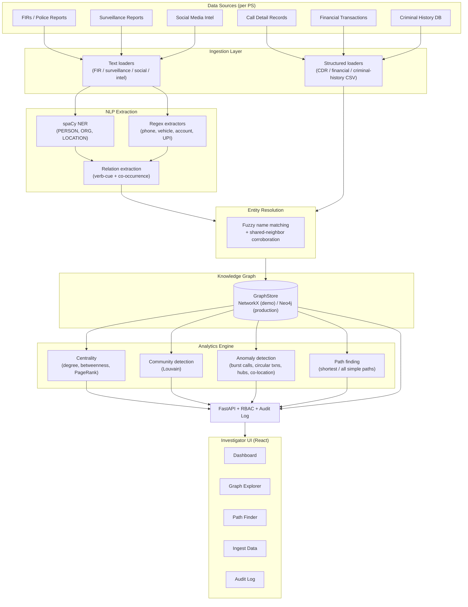

# PRAHARI — Detailed Solution: Research, Architecture, and Development Roadmap

**SIH Problem Statement 26189** · AI-Powered Criminal Network Analysis System
**Organization:** Ministry of Home Affairs · **Department:** NCRB, Women Safety Division · **Category:** Software · **Theme:** Blockchain & Cybersecurity

---

## 1. Problem, restated

Investigators sit on large volumes of crime-relevant data — FIRs, Call Detail Records (CDRs),
financial transaction records, surveillance reports, social-media intelligence, criminal-history
databases, intelligence-agency reports — but that data is **fragmented, unstructured, and spread
across systems**. The connections between suspects, associates, locations, vehicles and money are
real but invisible until someone manually cross-references dozens of documents. That's slow, doesn't
scale, and misses things.

The ask: an AI system that ingests all of the above, extracts entities and relationships, builds a
relationship map, identifies influential individuals, flags suspicious patterns, and gives
investigators visual and analytical tools to act on it.

## 2. Prior art and what we learned from it

Before designing anything, we looked at how this problem is already solved elsewhere, because a
hackathon reinventing a worse version of an existing category would be a waste of the time box:

- **Palantir Gotham, IBM i2 Analyst's Notebook, Maltego, DataWalk, Sentinel Visualizer** — the
  established commercial category. Despite different UIs, they converge on the same pipeline: ingest
  heterogeneous sources → extract entities/relations → unify into a knowledge graph → run graph
  analytics (centrality, community detection) → visual link-chart exploration + case management. We
  adopted that pipeline shape deliberately rather than inventing a new one — it's proven.
- **Knowledge graphs + LLMs for criminal network analysis** (2024-2025 industry and research writeups,
  e.g. GraphAware / Policing Insight, and an arXiv paper on knowledge graphs + NLP for instant-messaging
  analysis in criminal investigations) — the emerging refinement is using LLMs for entity/relation
  extraction from messy text and for auto-generated investigative summaries, with the graph staying the
  structured, queryable backbone. We designed the NLP extraction layer (§5.2) as a swappable seam
  specifically so this upgrade path is a drop-in later, not a rewrite.
- **CDR-based phone-network forensics** (academic literature on call-graph analysis) — hub detection
  and calling-pattern anomalies (burst calling, one-time contacts around an incident) are established
  techniques we implemented directly (§5.5).
- **CCTNS** (Crime and Criminal Tracking Network & Systems) — NCRB's existing FIR/crime-records
  backbone. This is the closest real Indian government system in this space, and the design assumption
  throughout is that a production version of this system **ingests from CCTNS-shaped data** rather than
  replacing it — PRAHARI is an analysis layer on top of existing records systems, not a competitor to
  them.

## 3. What we built

A working prototype (not a mockup) implementing the full pipeline the PS describes, end to end, with a
real test suite and a real demo dataset that exercises every module. Code: [`/backend`](../backend),
[`/frontend`](../frontend). Setup: [`README.md`](../README.md). Demo walkthrough:
[`DEMO_DATA.md`](DEMO_DATA.md).

### 3.1 Architecture

### 3.2 Why each layer looks the way it does

**Ingestion (`backend/app/ingestion/`)** — one loader per PS-named structured source (CDR, financial,
criminal history), sharing a common contract: accept a list of dicts, return `(entities, relations)`
counts. This is what lets a file upload, a pasted CSV, and a unit-test fixture hit identical code paths.

**NLP extraction (`backend/app/nlp/`)** — spaCy's statistical NER handles PERSON/ORG/LOCATION;
purpose-built regex handles the entity types generic NER is bad at (Indian phone numbers, vehicle
plates, UPI handles, account numbers); a light verb-cue + sentence-co-occurrence pass extracts typed
relations (`CALLED`, `TRANSACTED_WITH`, `OWNS`, `MET_AT`, …). Every extracted fact keeps its source
sentence as **evidence** — nothing in the graph is untraceable back to the original document, which
matters when an inference might end up referenced in an investigation. This is a strong rule-augmented
baseline, not a fine-tuned model, by design: it needs no GPU and no labelled training data to run today.
`extract_from_text()` is the one seam a production build swaps for a fine-tuned transformer or an
LLM-based extractor (§9.1) without touching anything downstream.

**Entity resolution (`backend/app/resolution/`)** — structured identifiers (phone, plate, account)
already collapse deterministically by natural key. The hard case is names: "Raj Malhotra" vs. "Rajesh
Malhotra" vs. "R. Malhotra" across a CDR, an FIR, and a social post. We only auto-merge near-exact
matches (≥97% fuzzy similarity); everything else is surfaced as a **reviewable candidate**
(`GET /api/entities/resolution/candidates`) requiring an analyst's confirmation. Silently merging two
different people who happen to share a name is a serious investigative error, so the system is
deliberately conservative here rather than "smart."

**Knowledge graph (`backend/app/db/graph_store.py`)** — a single `GraphStore` interface with two
implementations: an in-process NetworkX store (default; zero infrastructure, used for the demo and
tests) and a Neo4j store (production-shaped; real Cypher, APOC, ready for the Graph Data Science plugin
at scale). Every other module — analytics, API routes — only knows the interface, never which backend
is active. This means the *entire application* runs today with nothing installed but Python packages,
and scales to a real deployment by changing one environment variable, not by rewriting code.

**Analytics (`backend/app/analytics/`)** — directly answers the PS's four asks:
- *"Identify key individuals who play influential roles"* → `centrality.py`, blending degree
  (hubs), betweenness (bridges/intermediaries — often the actual investigative target, not the loudest
  node), and PageRank (connected-to-the-connected) into one ranked, explainable score.
- *"Build relationship maps"* → the graph itself, plus `community.py` (Louvain clustering into
  probable gangs/cells).
- *"Detect suspicious patterns and unusual activities"* → `anomaly.py`: burst calling, high
  short-call ratios (signalling behavior), circular money transfers (classic layering), statistical
  degree outliers (sudden unexplained hubs), and location co-convergence (independent reports placing
  multiple people at the same place/time).
- *"Assist investigators with visual and analytical insights"* → `pathfinder.py` answers "how are
  these two suspects connected" — the single most common question a link chart exists to answer — plus
  the whole UI layer (§3.3).

**API + governance (`backend/app/api/`, `backend/app/services/audit.py`)** — role-based access
(investigator / analyst / admin), JWT auth, and an append-only audit log on every ingest, merge, and
(for admin) log read. This is not incidental: a system built for NCRB is implicitly evidentiary, and
misuse accountability matters as much as the analysis quality.

### 3.3 Investigator UI (`frontend/`)

React + TypeScript + Tailwind, talking to the API. Five screens, each mapped to one investigative task:

| Screen | Answers |
|---|---|
| **Dashboard** | "What does the case look like right now?" — entity/relationship counts, top influencers, open anomalies. |
| **Graph Explorer** | "Who is this person connected to?" — search, force-directed graph, click-to-expand 2-hop neighborhoods, entity detail panel with full source attribution. |
| **Path Finder** | "How are these two suspects connected?" — shortest evidentiary chain between any two entities. |
| **Ingest Data** | Paste a report or upload a CSV and watch it land in the graph immediately — makes the pipeline legible rather than a black box. |
| **Audit Log** | "Who did what, when?" — admin-only accountability trail. |

## 4. Data model

Generic entity/relation vocabulary (`backend/app/graph/schema.py`) rather than one bespoke table per
source, so a new source type never requires a schema migration — only a new loader that emits the same
`(type, label, attributes)` / `(source, target, relation_type)` shapes:

**Entities:** `PERSON`, `PHONE`, `VEHICLE`, `LOCATION`, `ORGANIZATION`, `FINANCIAL_ACCOUNT`, `EVENT`, `CASE`
**Relations:** `CALLED`, `TRANSACTED_WITH`, `ASSOCIATED_WITH`, `OWNS`, `PRESENT_AT`, `MEMBER_OF`, `MENTIONED_WITH`, `LINKED_TO_CASE`, `AUTHORED`

Every relation carries a `weight` (evidentiary strength — source-type trust × extraction confidence,
see `schema.SOURCE_TRUST`) and an `evidence` list of source document IDs, so the UI and any downstream
query can distinguish a fact corroborated by five sources from one mentioned once in a single social
post.

## 5. Why this tech stack

| Choice | Reasoning |
|---|---|
| **FastAPI (Python)** | The NLP/graph-analytics ecosystem (spaCy, NetworkX, rapidfuzz, python-louvain, the Neo4j driver, and a future LangChain/transformers upgrade) is Python-native; FastAPI gives typed request/response models (Pydantic) for free, which matters for an API a separate frontend team consumes. |
| **spaCy + regex, not an LLM, for extraction today** | Runs with no GPU and no API cost, fully offline-capable (a real requirement for law-enforcement data that may not be allowed to leave a secure network) — important given the sensitivity of the data categories in this PS. §9.1 covers the upgrade path once labelled data and a secure-inference story exist. |
| **NetworkX default / Neo4j production** | A demo/pilot never needs an external database; a real deployment needs Neo4j's native graph storage and Graph Data Science library to stay performant at NCRB-scale entity/edge counts. One interface, two implementations, zero code change at the call sites (§3.2). |
| **React + TypeScript + Tailwind, react-force-graph** | Force-directed graph rendering is the standard, immediately legible way to present a link chart to a non-technical investigator; TypeScript keeps the API contract (mirrored from the Pydantic schemas) honest across a growing UI. |
| **JWT + RBAC + audit log from day one** | Retrofitting access control and accountability onto an analysis tool after the fact is how these systems get misused or leak. Built in from the prototype stage, not deferred to "production hardening." |

## 6. Evaluation approach (how we'd know it's working)

For a pilot deployment, not just a demo:

1. **Extraction precision/recall** against a held-out set of manually annotated FIRs/reports (the
   standard NER evaluation methodology) — target ≥85% F1 on the entity types in §4 before trusting
   auto-extraction over manual review.
2. **Entity-resolution precision** — false-merge rate on a labelled name-variant test set; false merges
   are the costlier error class (see §3.2), so precision is weighted above recall in tuning
   `name_match_threshold`.
3. **Influencer-ranking validity** — back-test centrality rankings against closed cases where the actual
   kingpin/financier/intermediary role is already known from the verdict, and check rank correlation.
4. **Anomaly detector precision** — false-positive rate per detector type, reviewed by investigators;
   each detector's threshold (`backend/app/core/config.py`) is a tunable, not a hard-coded constant, for
   exactly this reason.
5. **Time-to-insight** — the actual operational metric NCRB would care about: time for an investigator
   to go from "raw case file" to "here are the three people who matter and how they're connected,"
   measured against the manual-cross-referencing baseline.

## 7. Responsible-AI and governance considerations

This is intentionally not an afterthought section, given the domain:

- **Explainability over black-box scoring.** Every influencer rank, community assignment, and anomaly
  flag traces back to concrete graph structure and cited source documents — never an opaque model
  score an investigator can't interrogate or a defense lawyer can't question.
- **Human-in-the-loop by design.** Entity merges below the auto-merge confidence bar require analyst
  confirmation (§3.2); anomaly flags are *flags*, not accusations — the system surfaces patterns for a
  human investigator to assess, not a verdict.
- **Audit trail as a first-class feature**, not a log file nobody reads — every mutating action is
  attributed to a named account and independently reviewable (§3.2).
- **Access control by role**, so a coordinator/analyst-tier account structurally cannot see or exfiltrate
  more than their function requires — the same design pattern NCRB systems already use (mirrored, not
  invented, from how e.g. CCTNS-adjacent tooling scopes access).
- **Bias awareness.** A network-analysis system trained or tuned only on prior conviction data can
  entrench existing enforcement bias. Centrality/anomaly scores here are structural (based on
  communication/financial/co-presence patterns), not derived from demographic attributes, and
  `criminal_history` risk flags are surfaced as investigative context, never blended silently into the
  influencer ranking algorithm itself.
- **Data minimization / offline capability.** No data leaves the deployment boundary — no third-party
  LLM API calls are made by default (§9.1's LLM upgrade path is explicitly framed as "self-hosted /
  in-VPC" for this reason).

## 8. Current prototype scope vs. a production system

What's real today: the entire pipeline in §3.1, actually running, with 12 passing automated tests
(`backend/tests/`) and a synthetic-but-representative demo dataset that exercises every analytics
module (`docs/DEMO_DATA.md`). What's intentionally out of scope for a hackathon-timeboxed prototype is
in §9 below.

## 9. Development, advancement, and roadmap to production

### 9.1 NLP: from rule-augmented baseline to a fine-tuned / LLM-assisted pipeline
- Fine-tune a transformer NER model (e.g. IndicBERT / a multilingual model) on annotated Indian
  FIR/crime-report text, once such a labelled corpus exists — the biggest realistic accuracy lever.
- Add regional-language support (Hindi and major regional languages) — FIRs are frequently filed in the
  local language, and an English-only pipeline misses most real input.
- Introduce a self-hosted LLM extraction pass (in-VPC, no external API calls — see §7) for
  higher-recall relation extraction and automatic case-summary generation, with the current
  `extract_from_text()` seam already positioned for this swap.
- OCR + document-layout pipeline for scanned/handwritten FIRs (many are still filed on paper).

### 9.2 Analytics: from explainable heuristics to validated models
- Replace fixed anomaly thresholds with a learned model once labelled case outcomes exist to train
  against (e.g. an isolation-forest or temporal-GNN layer on top of the same graph features) — validated
  per §6.4, not shipped speculatively.
- Temporal graph analysis: how the network's structure and key-influencer ranking evolve over time,
  not just a static snapshot.
- Cross-case entity linking: surfacing when a "new" case actually reconnects to entities from a prior,
  separately-filed case — a known blind spot of siloed case management.

### 9.3 Data integration: from demo loaders to real system interoperability
- A CCTNS connector (§2) so FIR data flows in without manual re-entry — this is the highest-leverage
  integration for a real NCRB deployment.
- Direct telecom-operator CDR feed integration (under lawful-intercept authorization workflows) instead
  of manual CSV upload.
- Financial Intelligence Unit (FIU-IND) / bank SFTP-style feed integration for transaction records.
- A structured intake for OSINT/social-media monitoring tools already in use by state police
  cyber-cells, rather than the current manual JSON upload.

### 9.4 Scale and infrastructure
- Move off the in-memory audit log and demo user directory to a persistent, tamper-evident store
  (e.g. Postgres with row hashing / a write-once object store) and the agency's real identity provider
  (§ "Auth" in `backend/app/core/security.py` is already isolated behind one seam for this).
- Exercise the Neo4j + Graph Data Science backend at real scale (millions of entities, tens of millions
  of edges) and move the analytics call sites from "pull graph into NetworkX" to native GDS procedure
  calls (flagged explicitly in `graph_store.py`'s docstring today).
- Horizontal scaling of the ingestion pipeline (a task queue — Celery/RQ — instead of synchronous
  request-time processing) once document volume exceeds interactive-request size.

### 9.5 Security hardening for production deployment
- Replace the demo in-memory JWT user directory with the agency's SSO/identity provider.
- Encryption at rest for the graph database and audit log; field-level encryption for the most
  sensitive attributes (e.g. financial account numbers).
- Formal chain-of-custody export: a signed, timestamped bundle of an entity's full evidence trail
  suitable for court submission.
- Penetration testing and a full STRIDE-style threat model before any real case data touches the system
  (the current RBAC + audit log design in §3.2/§7 is the starting point, not the finish line).

### 9.6 UX depth for real investigative workflows
- Case management: group entities/evidence under a formal `CASE` node (already in the schema, §4) with
  its own workflow, rather than the current flat entity/relation view.
- Geospatial view: plot `LOCATION`-typed entities on an actual map, not just as graph nodes — important
  given how much of the PS's source data (CDR tower locations, addresses, surveillance) is inherently
  spatial.
- Timeline view: a chronological reconstruction of events per entity/case, complementing the network
  view.
- Bulk entity-resolution review queue (the API already exists at `/api/entities/resolution/candidates`
  — §3.2 — the UI page for it is the next build item).

## 10. Suggested SIH presentation structure

1. The problem, in the judges' own domain language (fragmented data → missed connections → slower
   investigations) — 30 seconds.
2. One live demo: Dashboard → Graph Explorer → Path Finder → Ingest Data, using the walkthrough in
   `docs/DEMO_DATA.md` — this is the strongest part of the pitch because it's real and interactive, not
   slides.
3. Architecture diagram (§3.1) — 60 seconds, emphasizing the zero-infra-to-production seam (§3.2), since
   judges will ask "does this actually scale."
4. Roadmap (§9) — shows the team understands the gap between a hackathon prototype and an NCRB-grade
   deployment, which is usually the differentiator between a good demo and a winning one.
